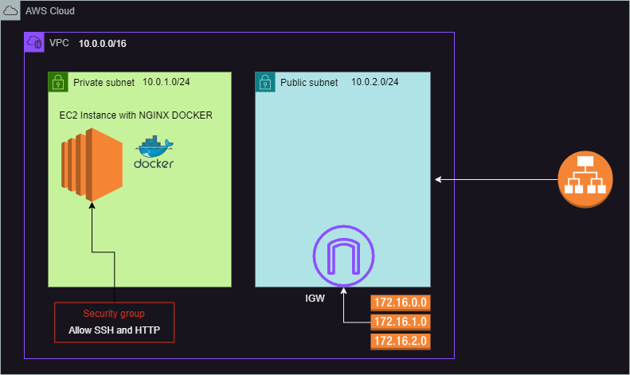
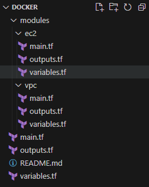

# Terraform AWS EC2 + Docker + NGINX Setup

## Objective

Provision an EC2 instance in a private subnet within a VPC, running a Docker container with NGINX to display details of how to perform a card trick. The website will be accessible via a public Load Balancer.

[](docker.png)

[](structure.png)

## Table of Contents

- [Terraform AWS EC2 + Docker + NGINX Setup](#terraform-aws-ec2--docker--nginx-setup)
  - [Objective](#objective)
  - [Table of Contents](#table-of-contents)
  - [Prerequisites](#prerequisites)
  - [Steps](#steps)
    - [1. Clone the Repository](#1-clone-the-repository)
    - [2. Initialize Terraform](#2-initialize-terraform)
    - [3. Review the Execution Plan](#3-review-the-execution-plan)
    - [4. Apply the Configuration](#4-apply-the-configuration)
    - [5. Access the Website](#5-access-the-website)
    - [6. Clean Up Resources](#6-clean-up-resources)
  - [Conclusion](#conclusion)
    - [Explanation](#explanation)

## Prerequisites

1. **Terraform**: Install Terraform on your local machine or development environment. Follow the installation guide at [Terraform Installation](https://www.terraform.io/downloads.html).

2. **AWS CLI**: Install and configure the AWS CLI with your credentials. Follow the setup guide at [AWS CLI Installation](https://docs.aws.amazon.com/cli/latest/userguide/cli-configure-quickstart.html).

3. **AWS Account**: Ensure you have an AWS account with appropriate permissions to create VPC, EC2, and associated resources.

4. **SSH Key Pair**: Generate an SSH key pair for accessing the EC2 instance or use an existing key pair. The public key should be accessible to Terraform.

## Steps

### 1. Clone the Repository

Clone this repository to your local machine.

### 2. Initialize Terraform

Navigate to the project directory and run the following command to initialize the Terraform working directory:

```sh
terraform init
```

### 3. Review the Execution Plan

Generate and review the execution plan to understand the changes Terraform will make:

```sh
terraform plan
```

### 4. Apply the Configuration

Apply the Terraform configuration to provision the infrastructure. Confirm the action when prompted:

```sh
terraform apply
```

### 5. Access the Website

After Terraform completes the provisioning, it will output the public IP address of the EC2 instance. Use this IP address to access the NGINX web server in your web browser:

```sh
http://<instance_public_ip>
```

You should see details of how to perform a card trick.

[](results.png)

### 6. Clean Up Resources

To remove all resources created by Terraform, run:

```sh
terraform destroy
```

Confirm the destruction of resources when prompted.

## Conclusion

This project demonstrates how to use Terraform to provision an EC2 instance in a private subnet within a VPC, running a Docker container with NGINX. By following these steps, you can automate the deployment of cloud infrastructure and get hands-on experience with Terraform.

For further customization and advanced usage, refer to the Terraform Documentation and the AWS Documentation.

### Explanation

- **Modules**: Separate Terraform configurations for VPC and EC2 to create a modular structure.
- **Root Configuration**: Main Terraform configuration files that use the defined modules.
- **README.md**: Provides an overview, prerequisites, and step-by-step instructions to set up and deploy the project.

This setup ensures a clear separation of concerns and makes the Terraform configuration reusable and maintainable.
